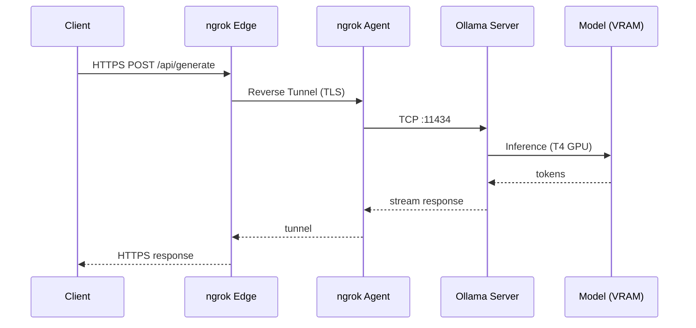

# Ollama Colab Free Server

[](https://www.python.org/)
[](LICENSE)
[](https://colab.research.google.com/github/hiroaki-com/colab-ollama-server/blob/main/ollama_colab_free_server_en.ipynb)
[](https://ollama.com/)

[English](./README.EN.md) | [日本語](./README.md)

https://github.com/user-attachments/assets/b40c8d63-ad0d-4149-993f-a11f12b4e58a

### Overview

An LLM server that runs Ollama on Google Colab's GPU and exposes the Ollama endpoint via an ngrok tunnel. Connect coding assistants like Continue or Claude Code to local inference models for free.

#### UML Interaction Sequence Diagram



| participant | Role |
|:---|:---|
| **Client** | Source tool such as Continue or Claude Code |
| **ngrok Edge** | ngrok cloud endpoint that provides a public HTTPS URL |
| **ngrok Agent** | pyngrok process running on Colab, established via `ngrok.connect(11434)` |
| **Ollama Server** | Local server started with `OLLAMA_HOST=0.0.0.0:11434` (`OLLAMA_KEEP_ALIVE=24h`) |
| **Model (VRAM)** | Model loaded into T4 GPU VRAM; generates tokens sequentially via `/api/generate` |

#### Key Features

- Completely free. No data sent to external APIs — privacy protected via local inference
- Select a model via UI; pull and launch are fully automated
- Instantly connectable from Continue or Claude Code
- OpenAI-compatible endpoint (`/v1`) also supported

### Quick Start

#### Notebooks

**English:**
```
https://colab.research.google.com/github/hiroaki-com/colab-ollama-server/blob/main/ollama_colab_free_server_en.ipynb
```

#### Steps

1. Open the notebook in Google Colab
2. Select Runtime > Change runtime type > T4 GPU
3. Create a free account at [ngrok](https://dashboard.ngrok.com/get-started/your-authtoken) and obtain your auth token
4. Run the Model Registry cell to load the model list, then select the model to launch
5. Enter your ngrok token in the Server cell and run it
6. Set the displayed endpoint URL in your client tool

### Client Configuration

After the server starts, configuration examples are printed automatically in the terminal.

#### Continue Extension (`~/.continue/config.yaml`)
> A sample configuration file is available: [`config.sample.yaml`](./config.sample.yaml).

```yaml
models:
  - title: qwen3:8b
    provider: ollama
    model: qwen3:8b
    apiBase: https://xxxx.ngrok-free.app
    contextLength: 16384
```

#### Claude Code (shell env)

```bash
export ANTHROPIC_BASE_URL=https://xxxx.ngrok-free.app
export ANTHROPIC_API_KEY=dummy
claude --model qwen3:8b
```

#### Codex (Extension / CLI)

`~/.codex/config.toml`
```toml
model = "qwen3:8b"
```

Shell env
```bash
export OPENAI_BASE_URL=https://xxxx.ngrok-free.app/v1
export OPENAI_API_KEY=dummy
code .    # When launching the extension
codex     # When launching the CLI
```

### Model Configuration

In the Model Registry cell, specify the models to launch as a comma-separated list.

```python
model_list = "qwen3:8b, qwen3:14b, qwen2.5-coder:7b, deepseek-r1:8b, qwen3.5:9b, qwen3.5:4b, qwen3.5:2b, qwen3.5:0.8b"
```

Find official model names at [https://ollama.com/search](https://ollama.com/search).

**Recommended model sizes for T4 GPU**

| Size | Performance | Notes |
|:---:|:---:|:---|
| 8B | Fast | Recommended |
| 14B | Moderate | Practical range |
| 20B+ | Slow | Not recommended |

### Tech Stack

- Runtime: Google Colab (Python 3.10+)
- LLM Engine: Ollama
- Tunnel: ngrok / pyngrok
- UI: ipywidgets

### License

MIT License. See [LICENSE](LICENSE) for details.

### Credits

- [Ollama](https://ollama.com/) - Local LLM inference engine
- [Google Colab](https://colab.research.google.com/) - Free GPU environment
- [ngrok](https://ngrok.com/) - Secure tunneling

### Support

- Bug reports: [Issues](../../issues)
- Questions & discussions: [Discussions](../../discussions)
