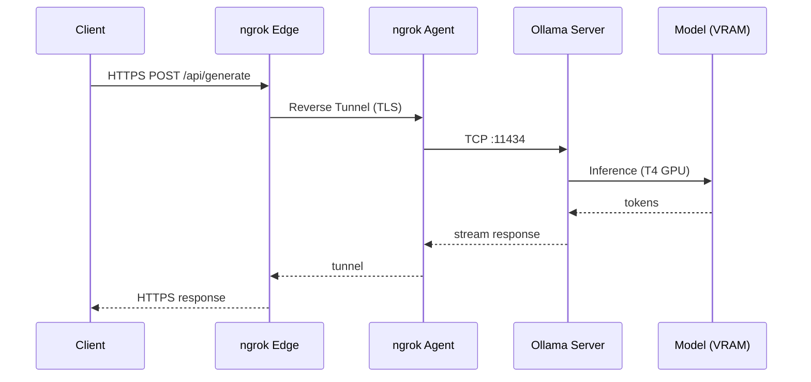

# Ollama Colab Free Server

[](https://www.python.org/)
[](LICENSE)
[](https://colab.research.google.com/github/hiroaki-com/colab-ollama-server/blob/main/ollama_colab_free_server_ja.ipynb)
[](https://ollama.com/)

[English](./README.EN.md) | [日本語](./README.md)

https://github.com/user-attachments/assets/98084bb4-6eb0-4e47-850b-f1bae0311c70

### 概要

Google ColabのGPU上でOllamaを動作させ、ngrokトンネル経由でOllamaエンドポイントを公開するLLMサーバーです。ContinueやClaude Codeなどのコーディングアシスタントから、無料でローカル推論モデルに接続できます。

#### 通信フロー



| 構成要素 | 役割 |
|:---|:---|
| **Client** | Continue / Claude Code 等の接続元ツール |
| **ngrok Edge** | ngrok クラウド上のエンドポイント。HTTPS で公開URLを提供 |
| **ngrok Agent** | Colab 上で動作する pyngrok プロセス。`ngrok.connect(11434)` で確立 |
| **Ollama Server** | `OLLAMA_HOST=0.0.0.0:11434` で起動したローカルサーバー（`OLLAMA_KEEP_ALIVE=24h`） |
| **Model (VRAM)** | T4 GPU の VRAM にロードされたモデル。`/api/generate` でトークンを逐次生成 |

#### 主な特徴

- 完全無料。外部APIへのデータ送信なし、ローカル推論によるプライバシー保護
- モデルをUIで選択し、プルから起動まで自動実行
- Continue や Claude Code から即座に接続可能
- OpenAI 互換エンドポイント（`/v1`）にも対応

### クイックスタート

#### 実行環境

**日本語版:**
```
https://colab.research.google.com/github/hiroaki-com/colab-ollama-server/blob/main/ollama_colab_free_server_ja.ipynb
```

#### 基本的な実行手順

1. Google Colabでノートブックを開きます
2. Runtime > Change runtime type > T4 GPU を選択します
3. [ngrok](https://dashboard.ngrok.com/get-started/your-authtoken) で無料アカウントを作成し、認証トークンを取得します
4. Model Registry セルでモデルリストを読み込み、起動するモデルを選択します
5. Server セルに ngrok トークンを入力して実行します
6. 表示されたエンドポイントURLを接続先ツールに設定します

### 接続先の設定例

サーバー起動後、ターミナルに設定例が自動出力されます。

#### Continue Extension（`~/.continue/config.yaml`）

> 設定のサンプルファイルとして [`config.sample.yaml`](./config.sample.yaml) を利用いただけます。

```yaml
models:
  - title: qwen3:8b
    provider: ollama
    model: qwen3:8b
    apiBase: https://xxxx.ngrok-free.app
    contextLength: 16384
```

#### Claude Code（環境変数）

```bash
export ANTHROPIC_BASE_URL=https://xxxx.ngrok-free.app
export ANTHROPIC_API_KEY=dummy
claude --model qwen3:8b
```

#### Codex（拡張機能 / CLI）

`~/.codex/config.toml`
```toml
model = "qwen3:8b"
```

環境変数（シェル）
```bash
export OPENAI_BASE_URL=https://xxxx.ngrok-free.app/v1
export OPENAI_API_KEY=dummy
code .    # 拡張機能の起動時
codex     # CLIの起動時
```

### モデル設定

Model Registry セルで、起動するモデルをカンマ区切りで指定します。

```python
model_list = "qwen3:8b, qwen3:14b, qwen2.5-coder:7b, deepseek-r1:8b"
```

モデル名は [https://ollama.com/search](https://ollama.com/search) でご確認いただけます。

**T4 GPU環境での推奨モデルサイズ**

| サイズ | パフォーマンス | 備考 |
|:---:|:---:|:---|
| 8B | 高速 | 推奨 |
| 14B | 中速 | 実用範囲 |
| 20B+ | 低速 | 非推奨 |

### 技術スタック

- Runtime: Google Colab (Python 3.10+)
- LLM Engine: Ollama
- Tunnel: ngrok / pyngrok
- UI: ipywidgets

### ライセンス

MIT License. 詳細は [LICENSE](LICENSE) を参照してください。

### クレジット

- [Ollama](https://ollama.com/) - ローカルLLM実行エンジン
- [Google Colab](https://colab.research.google.com/) - 無料GPU環境
- [ngrok](https://ngrok.com/) - セキュアトンネリング

### サポート

- バグ報告: [Issues](../../issues)
- 質問・議論: [Discussions](../../discussions)
